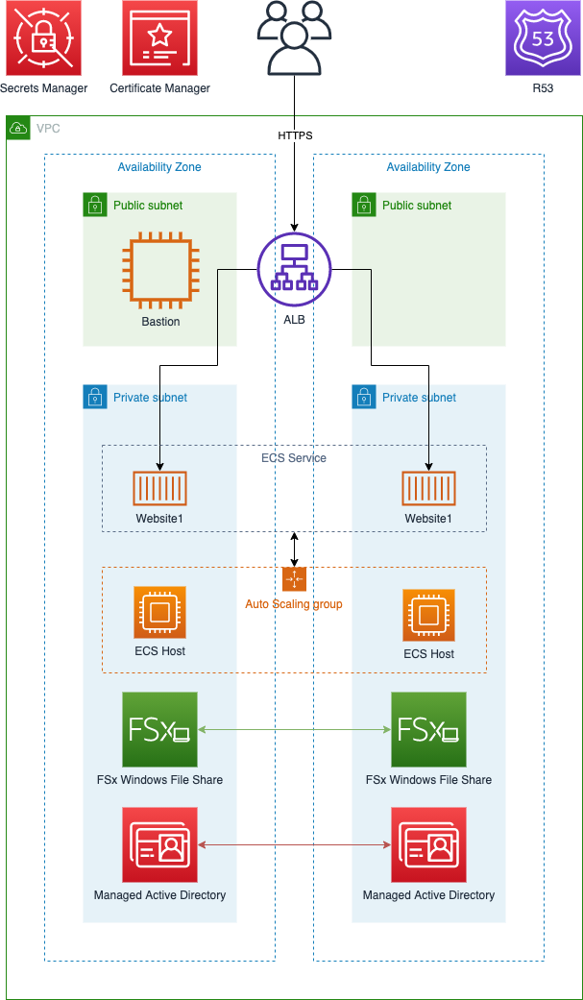

# AWS CDK ECS Windows and FSx
## Summary
This example deploys a complete stack on which to deploy Windows ECS containers with a FSx file share.

* The [AWS CDK](https://aws.amazon.com/cdk/) is used for infrastructure-as-code and deployment.  
* [AWS Managed Microsoft AD](https://aws.amazon.com/directoryservice/active-directory/) to provide Active Directory services
* Persistance is provided by [Amazon FSx and Amazon ECS support](https://aws.amazon.com/about-aws/whats-new/2020/11/amazon-ecs-supports-use-of-amazon-fsx-windows-file-server/).  
* A CDK Custom Resource is used to manage the ECS task definition as CloudFormation support for ECS/FSx is not yet available.
* High Availability is provided through out the stack.
* A TLS certificate is automatically created deployed to the Application Load Balancer using [AWS Certificate Manager](https://aws.amazon.com/certificate-manager/) enabling secure HTTPS Only communication with the deployed website.


## System Diagram



## Prerequisites
### Route 53
This project requires that you have already registered a domain and configured a hosted zone in [Route 53](https://aws.amazon.com/route53/). Once this is completed you will need the domainName, hostedZoneId and zoneName to continue the deployment.

### Git
* Install [git](https://git-scm.com/book/en/v2/Getting-Started-Installing-Git)
 
### Python 3.x
* Install [Python](https://www.python.org/downloads/)

### AWS
* An AWS account
* [AWS CLI](https://docs.aws.amazon.com/cli/latest/userguide/install-cliv2.html)
* AWS CLI [configured](https://docs.aws.amazon.com/cli/latest/userguide/cli-configure-quickstart.html#cli-configure-quickstart-config)
* [AWS CDK](https://docs.aws.amazon.com/cdk/latest/guide/getting_started.html)

## Download and Configure (One Time Only)
All instructions in this section should only need to be executed once when you are initially are setting up the sample.
### Clone Repo
```bash
git clone https://github.com/aws-samples/aws-cdk-ecs-windows-fsx
```

### CDK Bootstrap Environment
This sample uses features of the AWS CDK that require you to [Bootstrap](https://docs.aws.amazon.com/cdk/latest/guide/bootstrapping.html) your environment (a combination of an AWS account and region).  The sample is configured to use eu-west-1 (Ireland), so you will just need to replace the placeholder in the below command with your [AWS account number](https://docs.aws.amazon.com/general/latest/gr/acct-identifiers.html).
```bash
cdk bootstrap aws://ACCOUNT-NUMBER-1/eu-west-1
```

### Create Python Virtual Environment
You need a [Python Virtual Environment](https://docs.python.org/3/library/venv.html) to work in to ensure that the relevant modules are available to the sample.  The command must be executed inside the *aws-cdk-ecs-windows-fsx* folder.
```bash
cd aws-cdk-ecs-windows-fsx
python3 -m venv .venv 
```

## Deploy
### Terminal
All deployment commands must be executed inside the *aws-cdk-ecs-windows-fsx* folder, navigate there if you haven't already done so.
```bash
cd aws-cdk-ecs-windows-fsx
```
### Activate Python Virtual Environment
```bash
source .venv/bin/activate
```
The terminal prompt should be prepended with a **(.venv)** if you have activated the python virtual environment correctly.  You need to activate the virtual environment each time you start a new terminal session.

### Install Python modules
```bash 
pip3 install -r requirements.txt
```

### Website
1. Deploy the project using the following command in the root of the aws-cdk-ecs-windows-fsx folder (replacing the zone_name and hosted_zone_id with the correct values for your environment)
``` bash
cdk deploy cdk-ecs-windows-website1 --context zone_name="example.com" --context hosted_zone_id="Z0123456789ABCDEFGHIJ"
```
2. Wait for the new services to provision (This takes ~60 mins)
3. Visit the URL output by CDK e.g. https://website1.example.com
4. Each time a task/container is launched it will write it's task id to the shared file in the FSx share, you can force this by manually terminating a task in the ECS console and the service will launch a replacement.

### Bastion
1. You can deploy a bastion instance to administer Active Directory and the FSx share contents with this command
``` bash
cdk deploy cdk-ecs-windows-bastion --context zone_name="example.com" --context hosted_zone_id="Z0123456789ABCDEFGHIJ"
```
2. Once deployed you will have to manually add your home/office IP to the Instance's security group.

## Clean Up
1. When you are finished, you can delete all the stacks with the following command
``` bash
cdk destroy cdk-ecs-windows-website1 cdk-ecs-windows-bastion cdk-ecs-windows-cluster --context zone_name="example.com" --context hosted_zone_id="Z0123456789ABCDEFGHIJ"
```
## Contributing
See [CONTRIBUTING](CONTRIBUTING.md#security-issue-notifications) for more information.

## License
This library is licensed under the MIT-0 License. See the LICENSE file.


